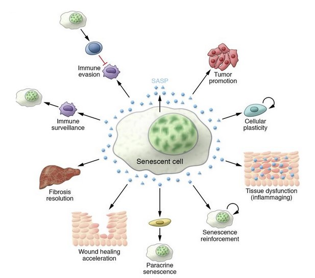
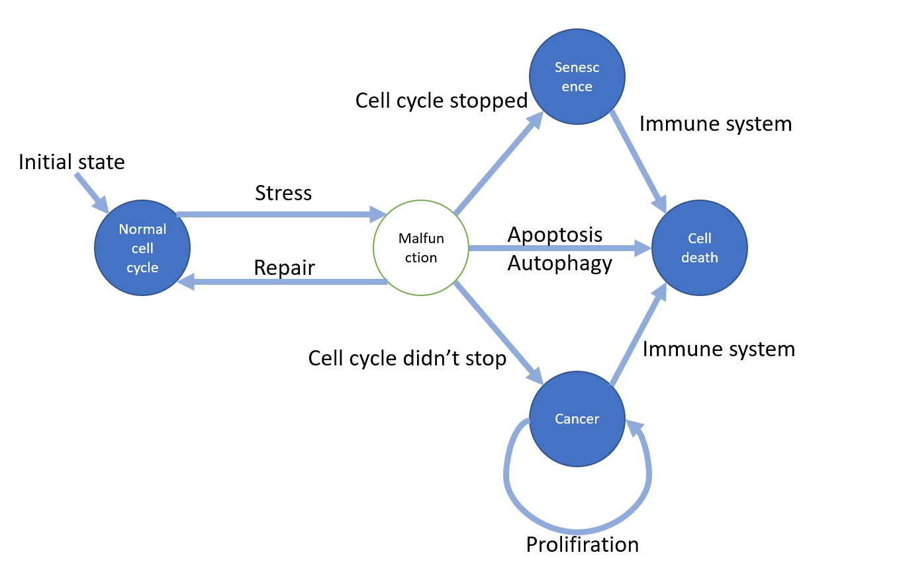

# Game of cell cycle life
### Written by
Yuval Kushmaro and Keren Avnery - https://github.com/kerenavnery

### Course and Assignment details
This repo is a suggested solution to an assignment written by us, as a class project
- Course name `Systems Medicine by Uri Alon` 
- https://www.weizmann.ac.il/mcb/UriAlon/download/systems-medicine-course-2019
- Weizmann Institute of Science, 2019

## This repository
A model for a tissue's cell cycle, based on `Conway's Game Of Life`. Implemented in python, forked from https://github.com/radomirbosak/game-of-life

## Cell cycle theory

Once critical stress is applied on a cell  - P53 ( transcription factor) is activated by the damage to the DNA →  halting the cell cycle and its proliferation. After the halt different fates are optional- if damage is successfully fixed the cell continues its cycle. if not the cell will become scenecent or will undergo apoptosis (programmed cell death). Once a cell is scenecent it can influence its environment in different ways as shown here:

 Another possible fate is cancer when the P53 pathway is overrun leading to proliferation of a cancerous tissue.

## State machine model
- A cell starts in normal cell cycle. Stress may cause it to malfunction, and several other states can emerge:

- Normal cell function - white colored
- Cancer - red colored
- Senscence - gray colored
- Cell death (apoptosis or autophagy) - black colored

### Limitations:
- This model does not allow cell reproduction
- No neighborhood effects (cells do not influence each other)
- Chances and rates are randomaly selected, true values need to be determined ampirically

## How to play
- Download ZIP of the repository
- Extract files, and open `main.py` file with python (required)
- This is a zero-player game! Simulation will start running by itself
- `Game Over` will appear when less than 10% of the board are normal cells, to simulate tissue failiure
- Click the screen to exit
- The interesting part is the code! Feel free to read, edit, comment and change parameters for better dynamics